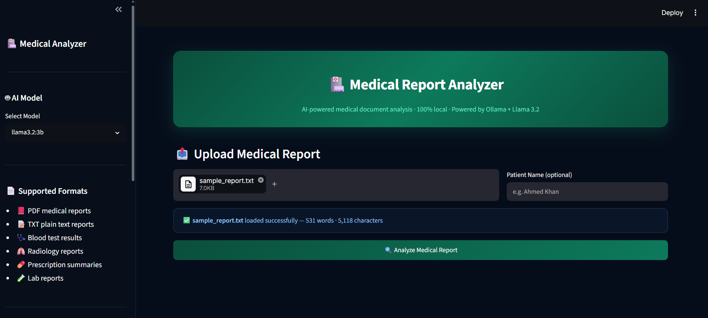
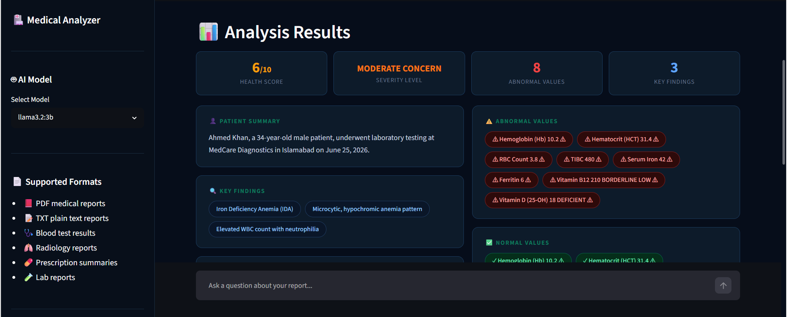
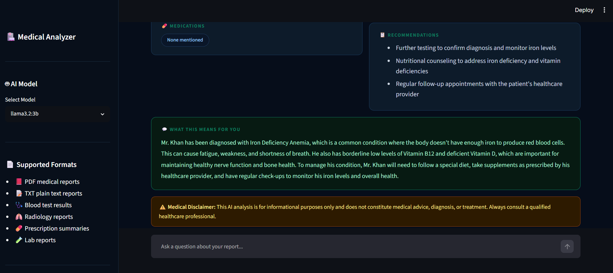
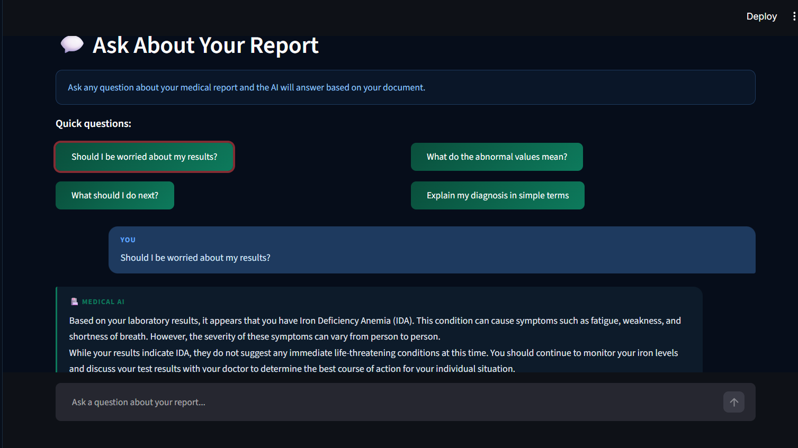

# 🏥 Medical Report Analyzer

> An AI-powered medical document analysis tool that reads your medical reports, extracts key findings, flags abnormal values, and answers your questions — running **100% locally** with no cloud APIs or data privacy concerns.

<br>


<br>

## 🎯 Project Overview

Devolped as part of the **Infrix AI & Automation Internship (Week-4 Task)**:

Medical reports are filled with complex terminology, abnormal value flags, and technical jargon that most patients struggle to interpret. This tool addresses that real-world gap — providing instant, structured AI analysis of any medical document, explaining results in plain English, and allowing patients to ask follow-up questions about their own reports. All processing happens locally via Ollama, ensuring complete data privacy with zero API costs.

---

## ✨ Features

| Feature | Description |
|---------|-------------|
| 📄 **PDF & TXT Support** | Upload blood tests, radiology reports, prescriptions, lab results |
| 🔍 **Smart Extraction** | Automatically identifies findings, diagnoses, medications, recommendations |
| ⚠️ **Abnormal Value Detection** | Flags values outside normal range with visual indicators |
| 📊 **Health Score** | AI-generated score (1–10) based on overall report findings |
| 🚦 **Severity Level** | Classifies report as Normal / Mild / Moderate / Serious / Critical |
| 💬 **Plain English Summary** | Translates medical jargon into language anyone can understand |
| 🤖 **Interactive Q&A** | Ask follow-up questions about your report and get instant answers |
| 🔒 **100% Local** | No data leaves your machine — complete privacy |
| 🎨 **Modern Dark UI** | Professional, clean Streamlit interface |

---

## 🏗️ Architecture

```
┌──────────────────────────────────────────────────────────┐
│                   Medical Report Analyzer                │
│                                                          │
│  Upload PDF/TXT                                          │
│       │                                                  │
│       ▼                                                  │
│  PyMuPDF (fitz)  ──►  Extracted Text                    │
│                              │                           │
│                              ▼                           │
│                    Structured Prompt                     │
│                    (Analysis / Q&A)                      │
│                              │                           │
│                              ▼                           │
│                   Ollama Local Server                    │
│                   (Llama 3.2:1b model)                   │
│                              │                           │
│                              ▼                           │
│                    Parsed AI Response                    │
│                              │                           │
│              ┌───────────────┼───────────────┐           │
│              ▼               ▼               ▼           │
│         Findings      Health Score      Q&A Chat         │
│         & Flags       & Severity        Interface        │
└──────────────────────────────────────────────────────────┘
```

---

## 🛠️ Tech Stack

| Component | Technology | Purpose |
|-----------|-----------|---------|
| Document Parsing | PyMuPDF (fitz) | Extract text from PDF/TXT files |
| Local LLM Runtime | Ollama | Run AI models locally |
| AI Model | Llama 3.2:1b | Medical report analysis & Q&A |
| Web Interface | Streamlit | Interactive UI |
| Language | Python 3.10+ | Core application |

---

## 📁 Project Structure

```
medical-report-analyzer/
│
├── app.py                  # Main Streamlit application
├── sample_report.txt       # Sample medical report for testing
├── requirements.txt        # Python dependencies
├── screenshots/            # UI screenshots
└── README.md
```

---

## 🚀 Getting Started

### Prerequisites

- Python 3.10+
- Ollama installed ([ollama.com](https://ollama.com))
- 4GB+ RAM (8GB recommended)

### 1. Clone the repository

```bash
git clone https://github.com/hamidnaseem3549/infrix-week-4-medical-report-analyzer.git
cd infrix-week-4-medical-report-analyzer
```

### 2. Install Python dependencies

```bash
pip install -r requirements.txt
```

### 3. Install and start Ollama

Download from [ollama.com](https://ollama.com), then:

```bash
# Pull the AI model (one-time, ~800MB)
ollama pull llama3.2:1b or pull llama3.2:3b

# Start the Ollama server
ollama serve
```

### 4. Launch the app

```bash
streamlit run app.py
```

Open [http://localhost:8501](http://localhost:8501) in your browser.

---

## 📖 Usage

1. **Upload** your medical report (PDF or TXT)
2. Click **"Analyze Medical Report"**
3. Wait 60–90 seconds for AI analysis
4. Review the structured results:
   - Health Score & Severity Level
   - Key Findings & Abnormal Values
   - Diagnoses & Medications
   - Plain English explanation
5. Use the **Q&A chat** for follow-up questions

### 🧪 Test with Sample Report

A sample blood test report is included:

```bash
# Upload sample_report.txt in the app to test
```

### Example Q&A Questions

- *"Should I be worried about my results?"*
- *"What does low hemoglobin mean?"*
- *"What are the most urgent things to address?"*
- *"Explain my diagnosis in simple terms"*

---

## 🔧 Configuration

### Change AI Model

In the sidebar, select any installed Ollama model. To install additional models:

```bash
ollama pull mistral
ollama pull phi3
ollama pull gemma3
```

### Ollama on Different Machine

Change the base URL in `app.py`:

```python
OLLAMA_BASE = "http://192.168.1.50:11434"
```

---

## 🐛 Troubleshooting

**`No module named 'fitz'`**
```bash
pip uninstall fitz PyMuPDF
pip install pymupdf
```

**`Cannot connect to Ollama`**
```bash
ollama serve   # Run in a separate terminal
```

**Slow responses**
- Use `llama3.2:1b` for fastest performance on 8GB RAM
- Close other heavy applications

---

## 🔒 Privacy

This application runs **100% locally**:
- ✅ No internet connection required after setup
- ✅ Medical data never sent to external servers
- ✅ No API keys required
- ✅ No data logging or storage

---

## ⚠️ Medical Disclaimer

This tool is for **informational and educational purposes only**. It does not constitute medical advice, diagnosis, or treatment. Always consult a qualified healthcare professional for medical decisions.

---

## 🔮 Potential Improvements

- [ ] DICOM image support for radiology scans
- [ ] Multi-report comparison over time
- [ ] Export analysis as PDF report
- [ ] Support for Urdu language reports
- [ ] Trend visualization for repeated lab values
- [ ] Doctor-specific report summary mode

---

## 📸 Screenshots

> *(Added screenshots after running the app)*

### Landing Page


### Analysis Results


### Plain English Summary


### Interactive Q&A Chat


---

## 👤 Author

**Hamid Naseem**
- 🎓 BS Computer Science — Pak-Austria Fachhochschule: Institute of Applied Sciences and Technology (PAF-IAST), Haripur
- 💼 AI & Automation Intern — Infrix (Summer 2026)
- 🎯 Building toward an AI Engineering career
- 🐙 GitHub: [@hamidnaseem3549](https://github.com/hamidnaseem3549)

---

## 📄 License

MIT License — free to use, modify, and distribute.
